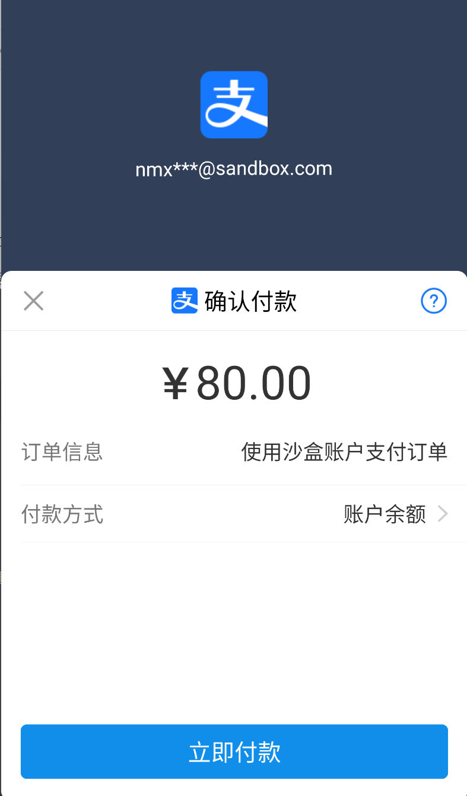
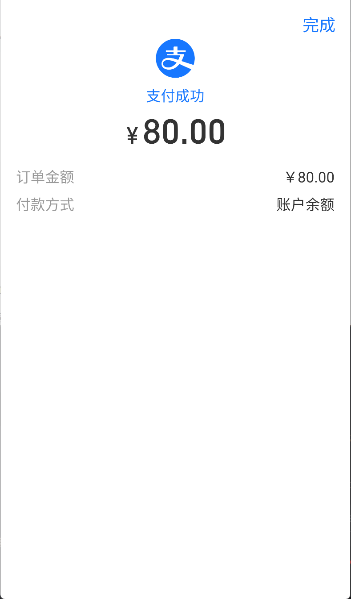

# CarSharingApp

# 关于支付宝支付功能说明
1、由于正式版的接口需要营业执照才能申请，因此采用沙箱版本进行，需要在Android模拟器或者手机上安装支付宝沙箱版本，apk文件下载地址为 http://partner-sys.cn-hangzhou.alipay-pub.aliyun-inc.com/fcservice/20230802145602/wallet_103908030_client_release_202308012045.apk
（直接点击链接无法跳转的话，复制网址到新的标签页中即可下载）

2、沙箱版本的支付宝初始余额是100W，用户名、登录密码、支付密码如下：

3、目前支付功能的触发绑定在钱包界面的“我的支付宝”按钮

点击后会触发支付宝支付功能

输入密码后即可完成支付

4、如果模拟器出现卡顿的情况，可以尝试提高模拟器分配的内存，应该可以好转

5、沙箱版本的支付宝似乎有时候存在闪退的问题，目前没有找到解决的方法